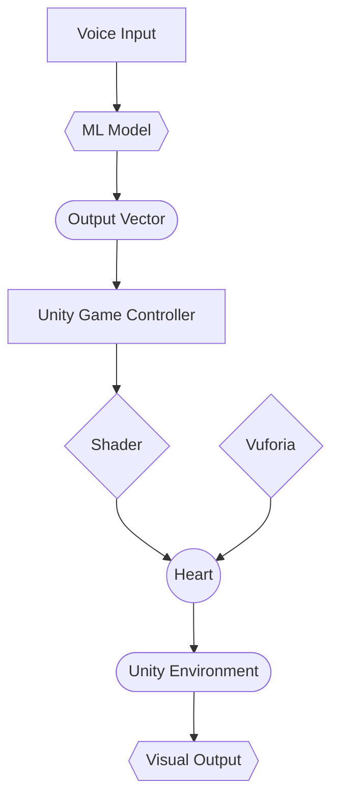

Dev Stack/components (basic):
- Python Script for Vector gen from voice input
- Vuforia integration
- Passthrough
- Blender model
- Noise shader
- Some sort of point cloud in Unity

Fun stuff:
- Cloud
- Collision boxes 
- Animation of the point cloud
- Bloom
- Spatial Audio
- Unique Vuforia Tags